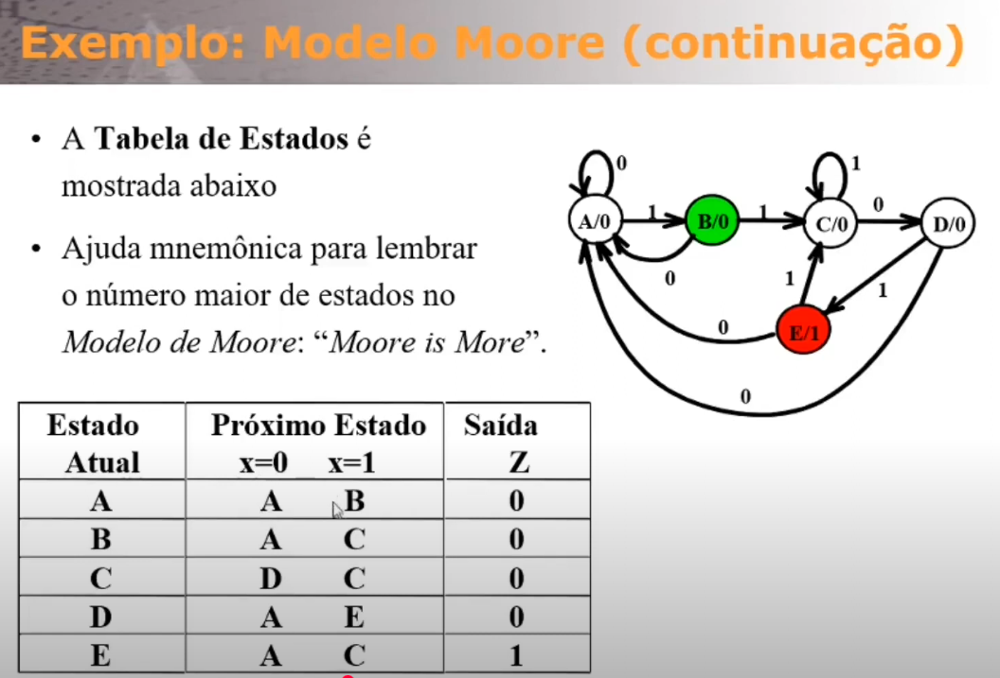
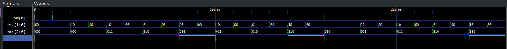

# Sequence Detector (VHDL)

Website to test 7-segment leds:

[https://g.co/gemini/share/8abe6d723705](https://g.co/gemini/share/8abe6d723705)


This project implements a sequence detector using a Finite State Machine (FSM) in VHDL. It detects the binary sequence **1101** on input `X`. When the sequence is recognized, output `Z` is set to `'1'` for one clock cycle; otherwise, `Z` remains `'0'`.

## 🔍 How It Works

### FSM States
- **A**: Initial state (waiting for first '1')
- **B**: Got first '1'
- **C**: Got '11'
- **D**: Got '110'

The FSM supports **overlapping detection**. For example, in the input `1101101`, the sequence `1101` is detected twice. After a successful detection, the FSM transitions to earlier states to continue monitoring for new sequences.

## 🛠️ Installation

Install the required tools:
```bash
sudo apt-get install ghdl gtkwave
```

## ▶️ Running the Simulation

c
```
   ghdl -a seq_rec.vhd && ghdl -a seq_rec_testbench.vhd && ghdl -e seq_rec_testbench && ghdl -r seq_rec_testbench --vcd=resposta.vcd --stop-time=500ns && ghdl -r seq_rec --wave=resposta.ghw && ghdl -r seq_rec_testbench --wave=resposta.ghw --stop-time=500ns && gtkwave resposta.vcd &
```

1. **Analyze the VHDL files:**
   ```bash
   ghdl -a seq_rec.vhd
   ghdl -a seq_rec_testbench.vhd
   ```
2. **Run the testbench and generate VCD waveform:**
   ```bash
   ghdl -e seq_rec_testbench
   ghdl -r seq_rec_testbench --vcd=resposta.vcd --stop-time=500ns
   ```
3. **Run and generate GHW waveform:**
   ```bash
   ghdl -r seq_rec --wave=resposta.ghw
   ghdl -r seq_rec_testbench --wave=resposta.ghw --stop-time=500ns
   ```
4. **View the waveform in GTKWave:**
   ```bash
   gtkwave resposta.vcd &
   ```

## 🧪 Testbench Explanation

The testbench (`seq_rec_testbench.vhd`) applies several input sequences to the detector:
- **Sequence 1:** `1 1 0 1` → Should trigger `Z='1'` after the last '1'.
- **Sequence 2:** `1 1 0 1` again (overlapping) → Should trigger `Z='1'` again.
- **False Pattern:** `1 0 1 1` → Should **not** trigger `Z='1'`.

### How to Interpret in GTKWave
- Open `resposta.vcd` in GTKWave.
- Add signals `CLK`, `RESET`, `X`, and `Z` to the waveform view.
- Look for moments when `Z` goes high (`'1'`). This indicates the sequence `1101` was detected.
- You can correlate the input `X` transitions with the output `Z` to verify correct detection and overlapping behavior.


#### Moore Machine and State Table


#### Example Waveform


## 📄 Additional Notes
- The FSM uses an asynchronous reset (`RESET`).
- The clock period is 20 ns (10 ns high, 10 ns low).
- The design is suitable for educational purposes and can be extended for other sequences.

---

For more details, see the source files and comments in `seq_rec.vhd` and `seq_rec_testbench.vhd`.
